# Reto 2 - Tipos de Navegación

## Objetivo:
Elige tres webs y identifica los tipos de navegación.

## Webs elegidas:
- __BREATHER__  
- __GITHUB__  
- __MEDIUM__

## Breather:

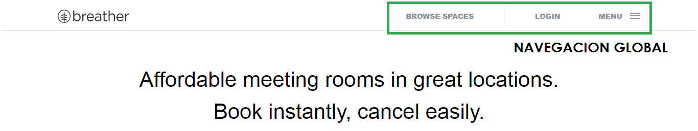
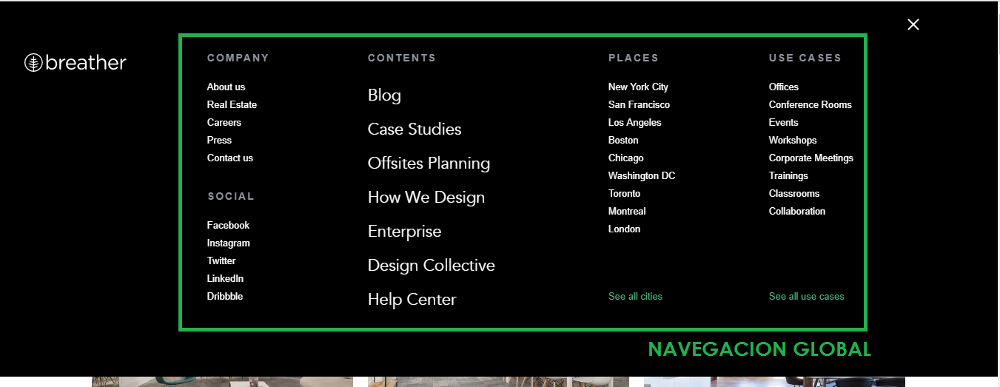
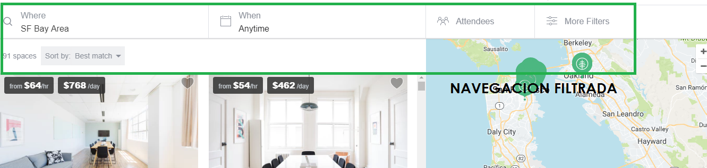
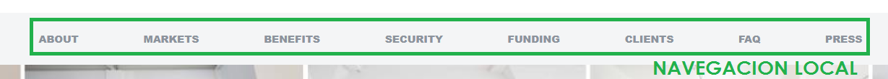
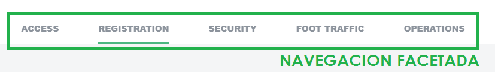
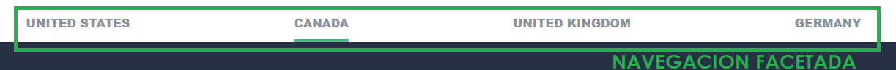
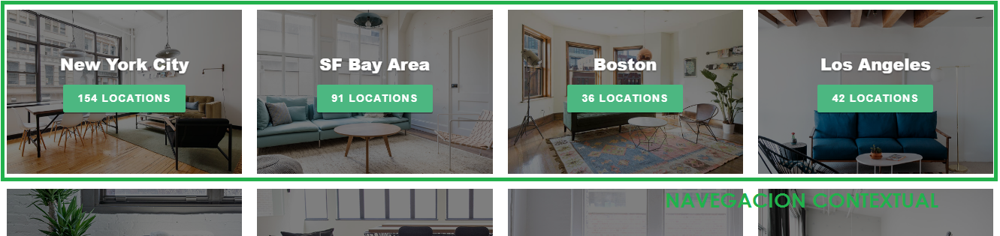
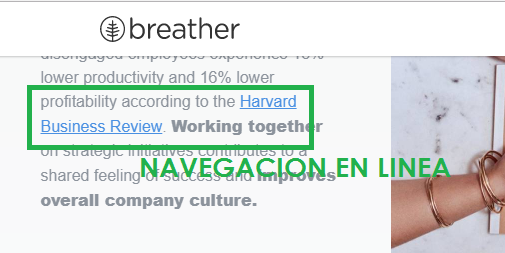

## Github:

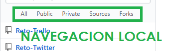
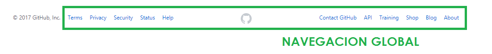
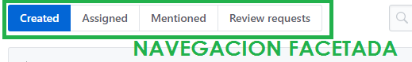
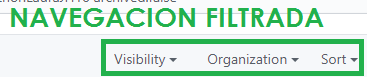
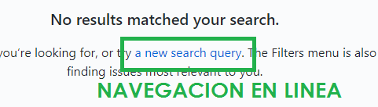

## Medium:

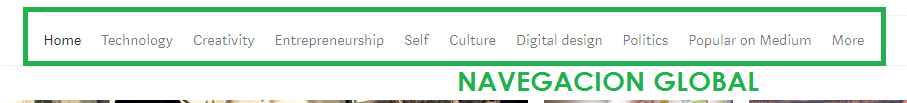

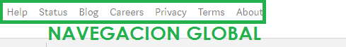
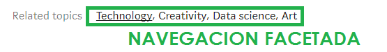
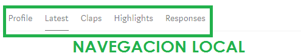

## Autora:

Laura Jimenez Hidalgo.